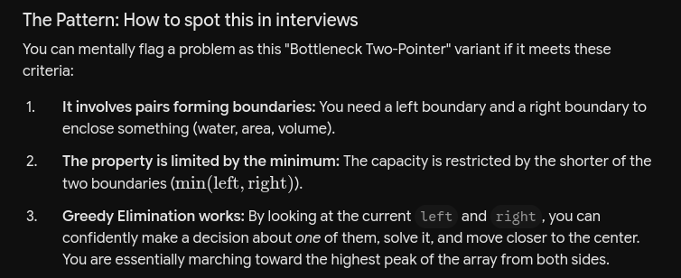

# Two Pointer — Pattern Taxonomy First

## Before picking problems, know there isn't one "two pointer" pattern — there are four distinct mechanics. Conflating them is the #1 junior mistake.

### Opposite-direction (converging)
### Fast-slow (Floyd's)
### Same-direction (read/write) (Both move forward, different speeds)
### Merge-style (dual array)

# How to Recognize the Pattern in an Interview (VIMP)

- Is the input a SORTED array/string, asking for a pair/triplet
satisfying a sum/difference condition OR is it a "Container" problem where water/area is trapped between two boundaries, and the boundary heights dictate which side is the bottleneck?
        │
        ├── YES → Opposite-direction two pointer
        │
- Is it a LINKED LIST, asking about cycles, middle node,
or "Nth from end"?
        │
        ├── YES → Fast-slow pointer
        │
- Does it ask "modify array IN-PLACE, O(1) extra space,
without extra array"?
        │
        ├── YES → Same-direction read/write pointer
        │
- Are there TWO separate sorted arrays/lists to combine/compare?
        │
        ├── YES → Merge-style two pointer

https://gemini.google.com/app/7cf807b179c64e6c?hl=en-IN

https://leetcode.com/problems/trapping-rain-water/description/ -> https://gemini.google.com/app/68e1ade151b66435?hl=en-IN

https://leetcode.com/problems/trapping-rain-water/description/ 

Summary of the Mechanism

    Initialize left = 0, right = len - 1.

    Keep track of left_max = 0 and right_max = 0.

    While left < right:

        Update left_max with height[left], and right_max with height[right].

        If left_max < right_max:

            Trapped water += left_max - height[left]

            left++

        Else:

            Trapped water += right_max - height[right]

            right--